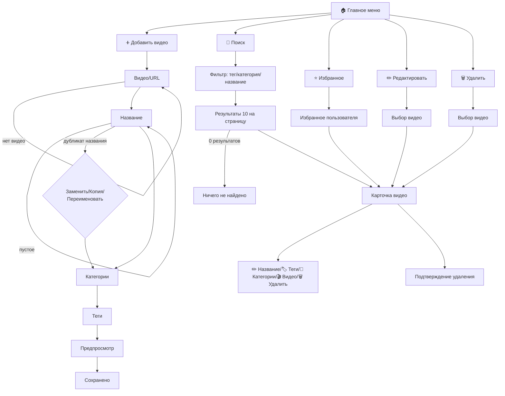

# Dancehall Telegram Bot

Технический дизайн Telegram-бота для каталога dancehall-видео с устойчивым FSM, валидацией, пагинацией, избранным и понятным UX редактирования.

## 1) Основные принципы UX/FSM

На **каждом шаге FSM** доступны системные действия:

- `⬅️ Назад` — вернуться на предыдущий шаг текущего сценария.
- `❌ Отмена` — завершить текущий сценарий и очистить временный контекст.
- `🏠 В меню` — перейти в главное меню, сбросив FSM.

Это обязательно для:
- выбора тегов;
- выбора категорий;
- редактирования;
- удаления.

> Правило: если пользователь вводит неожиданный формат, бот не падает, а возвращает подсказку и текущий шаг.

---

## 2) Главное меню

- `➕ Добавить видео`
- `🔎 Поиск`
- `⭐ Избранное`
- `✏️ Редактировать`
- `🗑 Удалить`
- `🏷 Управление тегами`
- `📁 Управление категориями`

---

## 3) Добавление видео (с проверками)

### Шаги
1. Загрузка видео (файл Telegram или URL).
2. Ввод названия.
3. Выбор категорий (множественный выбор).
4. Выбор тегов (множественный выбор).
5. Предпросмотр карточки.
6. Подтверждение сохранения.

### Валидации
- Видео не отправлено -> повторить запрос загрузки.
- Пустое название -> ошибка, попросить ввести снова.
- Название уже существует -> предложить:
  - `🔁 Заменить существующее`
  - `🆕 Создать копию`
  - `✏️ Изменить название`
- Видео уже есть (по `file_unique_id` или нормализованному URL) -> не дублировать, показать существующую карточку.

---

## 4) Поиск и выдача

### Варианты поиска
- По тегам.
- По категориям.
- По названию.

### Если не найдено
- Сообщение: `Ничего не найдено`.
- Кнопки: `⬅️ Назад`, `🏠 В меню`.

### Пагинация (обязательно)
Вывод списков по 10 элементов:

- Текст: `Страница 2/8`.
- Кнопки:
  - `⬅️` (предыдущая страница)
  - `1 | 2 | 3` (окно страниц вокруг текущей)
  - `➡️` (следующая страница)

Идентификатор страницы хранить в callback (`page`, `filter_type`, `filter_value`).

---

## 5) Карточка видео

Формат карточки:

```text
🔥 Butterfly
Категории: Female, Groove
Теги: hips, beginner
```

Действия на карточке:
- `⬇️ Скачать`
- `⭐ Добавить в избранное` / `💔 Убрать из избранного`
- `✏️ Редактировать`
- `🗑 Удалить`
- `⬅️ Назад`
- `🏠 В меню`

---

## 6) Избранное (на пользователя)

Разделено на два сценария:

1. **Переключатель в карточке**: добавить/убрать конкретное видео.
2. **Отдельный пункт меню `⭐ Избранное`**: открыть список только текущего пользователя.

Хранение: связка `user_id <-> video_id`, не глобальный список.

---

## 7) Редактирование через промежуточную карточку

После выбора видео показывать карточку и меню полей:

- `✏️ Название`
- `🏷 Теги`
- `📁 Категории`
- `🎬 Видео`
- `🗑 Удалить`
- `⬅️ Назад`
- `🏠 В меню`

Каждое поле редактируется отдельным под-сценарием с подтверждением изменений.

---

## 8) Удаление (безопасно)

1. Выбрать видео (с поиском и пагинацией).
2. Показать карточку перед подтверждением.
3. Кнопки:
   - `✅ Подтвердить удаление`
   - `⬅️ Назад`
   - `❌ Отмена`
   - `🏠 В меню`

---

## 9) Системные события и правила целостности

- `video_already_exists` -> повтор не создается.
- Удаление тега -> видео остаются, у них удаляется только связь с тегом.
- Удаление категории -> видео остаются, удаляется только связь с категорией.
- Удаление видео -> удаляются связи с тегами/категориями/избранным (cascade по связям).

Рекомендуемые ограничения БД:
- `videos.title` — индекс (можно не UNIQUE, если поддерживаем копии).
- `videos.file_unique_id` — UNIQUE (если это Telegram-файл).
- `videos.source_url_normalized` — UNIQUE (если URL-сценарий).
- `favorites(user_id, video_id)` — UNIQUE составной ключ.
- Таблицы связей many-to-many с внешними ключами.

---

## 10) FSM-маршруты (высокоуровнево)



---

## 11) Минимальная антиспам-логика

- Ограничение частоты действий на пользователя (например, 1 тяжелая операция/сек).
- Debounce на callback-кнопки (защита от двойного клика).
- Лимит длины текстовых полей (например, `title <= 120`).

---

## 12) Что считать готовым MVP

- Полный FSM с `Назад/Отмена/Меню` на всех шагах.
- Добавление видео с валидацией и обработкой дублей.
- Поиск с пагинацией 10/страница.
- Карточка видео с download + favorite toggle.
- Раздел `⭐ Избранное` на пользователя.
- Редактирование через карточку полей.
- Безопасное удаление с предпросмотром.
- Корректная обработка удаления тегов/категорий без потери видео.
